# AIOps with IBM Z and LinuxONE

In this tutorial, you will become familiar with three of IBM's strategic AIOps solutions - Instana, Turbonomic, and IBM Cloud Pak for AIOps - and the capabilities they have to monitor and manage IBM Z applications and infrastructure.

## Environment Overview


## Connecting to the Lab Environment

Connection instructions with platform URLs and credentials are listed in the [access file](/access.md).

## Exploring the Robot Shop Sample Application

1. **Open a web browser such as Firefox.**

2. In the browser, **navigate to your OpenShift console.** 

    The OpenShift console typically begins with `https://console-openshift-console-`. You can find this in the [access file](/access.md).

    You will now see the OpenShift console login page.

    

3. **Log in with your OpenShift credentials.**

4. **Under the developer perspective, navigate to the Topology page for the `robot-shop` project.**

    

    Robot Shop is a simulated online store where you can purchase robots and AI solutions. Robot Shop is made up of many different microservices that are written in different programming languages. There are 12 different microservices written in languages including NodeJS, Python, Spring Boot, and Go, along with containerized databases including MongoDB, MySQL, and Redis. Each icon in the Topology represents an OpenShift deployment for a specific microservice. Each microservice is responsible for a single function of the Robot Shop application that you will see in the following steps.

5. **Open the Robot Shop web application by clicking the small button in the top right of the `web` icon.**

    This is simply a hyperlink that will take you to the Robot Shop application homepage.

    

    The Robot Shop homepage should appear like the screenshot below, with all of the same options in the left side menu.

    

6. **Explore the website and its functionalities from the left side menu.**
   
    You can register a new user, explore the catalog of purchasable robots, give them ratings, and simulate a purchase.

    Notice that from the OpenShift and Robot Shop perspectives, you don't get much of a sense of how the various microservice applications are plumbed together, how they are performing, if they have the correct amount of resources, or if any issues are affecting the application currently. In other words, there is a lack of *observability*, *application performance management*, and *proactive problem remediation*.

## Instana

### Overview of Instana Observability

Instana is an enterprise observability solution that offers application performance management - no matter where the application or infrastructure resides. Instana can monitor both containerized and traditional applications, various infrastructure types including OpenShift, public clouds & other containerization platforms, native Linux, z/OS, websites, databases, and more. The current list of supported technologies can be found [in the Instana documentation](https://www.ibm.com/docs/en/instana-observability/current?topic=configuring-monitoring-supported-technologies).

### Viewing the Instana Agent on OpenShift

7. In the OpenShift cluster, **navigate to the `instana-agent` project then click the circular icon on the Topology page that is labeled `instana-agent`.**

    

    This is the Instana agent that is collecting all the information about the containerized applications running on OpenShift and sending that information to the Instana server.
    
    The agent is deployed as a [DaemonSet](https://kubernetes.io/docs/concepts/workloads/controllers/daemonset/), which is a Kubernetes object that ensures one copy of the pod runs on each compute node in the cluster. Each individual Instana agent pod is responsible for the data and metrics collection for the compute node it runs on.

8. **Click the other circular icon on the Topology page that is labeled `k8sensor`.**

    

    The `k8sensor` pods are responsible for gathering information about the OpenShift cluster itself and all of the Kubernetes objects in includes - pods, namespaces, routes, etc., and sending that information to the Instana server. 

9.  **Click the `view logs` hyperlink next to one of the `k8sensor` pods in the right-side menu.**

    ```text
    2024/03/19 16:45:53 main.go:365: pod=instana-agent/k8sensor-5b46b459dc-lrz9z shards=[01 04 07 0A 0D 10 13 16]
    2024/03/19 16:45:53 main.go:365: call=senseLoop PodsCount={285} PodsRunning={282} PodsPending={3} snitch=pod sense.min=0 sense.99.9PCTL=0 sense.max=0 apply.min=2 apply.99.9PCTL=22 apply.max=27 http.do.min=0 http.do.99.9PCTL=97 http.do.max=104 encode.pmin=2.41KB encode.p99.9PCTL=34.34KB encode.pmax=254.29KB encode.tmin=0 encode.t99.9PCTL=45 encode.tmax=97 total.min=5 total.99.9PCTL=110 total.max=132 send.calls=9600 send.errors=0
    ```

    If you would like to see what data the agents are collecting or if you need to debug issues with collecting data from certain workloads running on OpenShift, these pod logs are a good first place to look.

    In the next section, you will take a look at the other side of the OpenShift Instana agent - the Instana server that is receiving the data.

### Navigating the Instana Dashboard

9. **In a web browser, navigate to your Instana server.** You can find this address in the [access file](access.md).

10. **Log in with your Instana credentials.**

    When you first log into Instana, you will be taken to the Home Page. This is a customizable summary page that shows the key metrics for any component of your environment in the timeframe specified in the top right of the screen.

    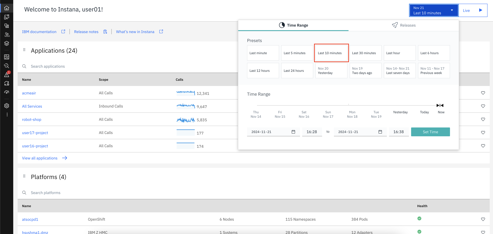

11. **Set the time frame to Last Hour and click the Live button.**

    You are now seeing metrics for the environment over the previous hour, and it is updating in real time with up to 1 second granularity and no sampling.

    The next thing to notice is the menu on the left side of the page. If you hover over the left side panel, you will see a menu of links that will let you dive into different sections of the Instana dashboard, rather than seeing every option.

12. **Click the left side panel so the menu appears.**

    

    Next, you will go through each section in the menu.

13. **Click the Websites & Mobile Apps option in the left-side menu.**

    You can see that Instana is monitoring a website named `Robot Shop Website`. This is the set of webpages associated with the Robot Shop sample application that is deployed on OpenShift on IBM Z. Instana supports [website monitoring](https://www.ibm.com/docs/en/instana-observability/current?topic=instana-monitoring-websites) by analyzing browser request times and route loading times. It allows detailed insights into the web browsing experience of users, and deep visibility into application call paths. The Instana website monitoring solution works by using a lightweight JavaScript agent, which is embedded into the monitored website.

14. **Click the Robot Shop Website hyperlink.**

    

    With website monitoring, there numerous filters and tabs with more information.

15. **Navigate through the various tabs to show more data - Speed, Resources, HTTP requests, and Pages.**

    

    In the next section, you will dig into how the application resources on OpenShift on IBM Z are running.

16. **Click the Applications option in the left side menu.**

    This Instana instance has many applications configured. We will be exploring a few of them during this lab, primarily the `Robot Shop Microservices Application`.

    You may find it easier to use the search bar to the top right (under the timeframe selection).

17. **Click the Robot Shop Microservices Application hyperlink.**

    An application perspective represents a set of services and endpoints that are defined by a shared context and is declared using tags. For example, in this tutorial, the Robot Shop Microservices application perspective encompasses all services and endpoints that meet the tag `kubernetes-namespace=robot-shop`.

    Alongside the Robot Shop application running in OpenShift, there is a container running a Python application that generates load to each microservice. The metrics you see now in the application perspective are coming from that load generator. At the top of the page, you can see the total number of calls, the number of erroneous calls, and the mean latency for each call over the past hour.

    As with the Websites & Mobile Applications section, the Application perspective has various tabs that contain different information. When it comes to microservices, one of the most helpful tabs in the Application perspective is the Dependency graph.

18. **Click the Dependencies tab.**

    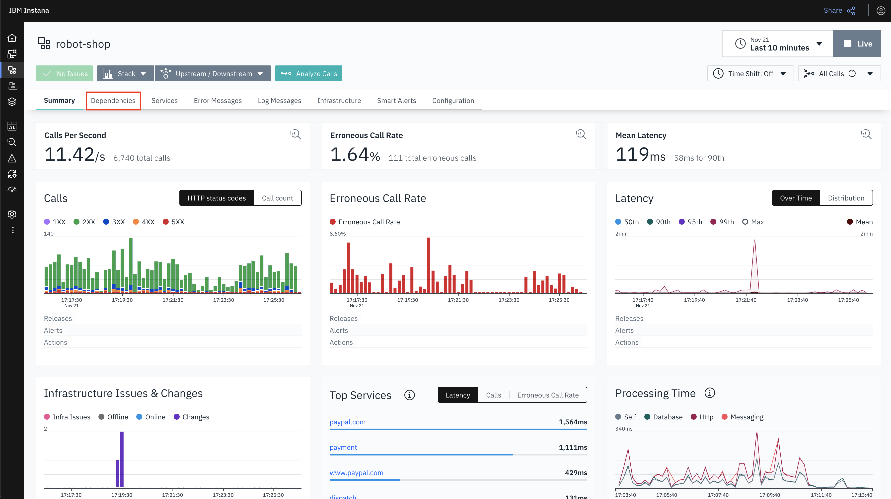

    The dependency graph offers a visualization of each service in the Application perspective, which services interact with each other, and visual representations of errors, high latency, or erroneous calls.

    There are more tabs in the Application perspective related to each individual service, error and log messages, the infrastructure stack related to the tag, and options to configure the Application perspective.

19. **Click through each of the tabs.**

    If you pay attention while clicking through these tabs, you will notice that the payments service has an unusually high number of erroneous calls, and you could dig into the specific calls to start debugging these errors.

    Next, you'll take a look at Instana's Kubernetes monitoring capabilities.

20. **Click the Platforms -> Kubernetes option in the left side menu.**

21. **Click the atsocpd1 (cluster) hyperlink.**

    

    OpenShift clusters are monitored by simply deploying a containerized Instana agent onto the cluster. Once deployed, the agent will report detailed data about the cluster and the resources deployed on it. Instana automatically discovers and monitors clusters, CronJobs, Nodes, Namespaces, Deployments, DaemonSets, StatefulSets, Services, and Pods.

    The Summary page shows the most relevant information for the cluster as a whole. The CPU, Memory, and Pod usage information are shown. The other sections, such as "Top Nodes" and "Top Pods" show potential hotspots which you might want to have a look at.

23. **Click the Nodes tab.**

    The Nodes tab shows all of the Kubernetes nodes in the cluster in real time.

24. **Click the Namespace tab, then search for `robot-shop` and select it.**

    

    In the `robot-shop` namespace page, you can see details for all of the Kubernetes resources that are deployed in the `robot-shop` namespace, including deployments, services, pods, and the relevant metrics for each object.

    In the next section, you will look at infrastructure metrics. In our case, the metrics related to a Linux server with an Oracle Database installed on it.

26. **Click the Infrastructure option in the left side menu.**

    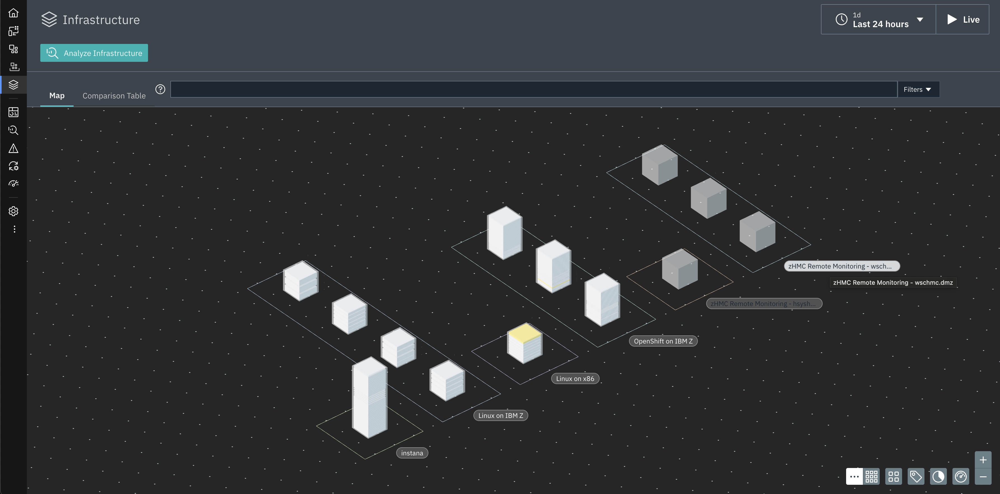

    The Infrastructure map provides an overview of all monitored systems. Within each group are pillars comprised of opaque blocks. Each pillar as a whole represents one agent running on the respective system. Each block within a pillar represents the software components running on that system.

27. **In the Infrastructure search bar, enter `oracledb` and select the resulting pillar.**

    

    You can now see information about the Oracle on IBM Z database monitored by Instana including its version, SID, and more.

28. **Click the "Open Dashboard" button for the OracleDB.**

    

    Now you see metrics specific to Oracle that a database administrator might be interested in.

    There are many IBM Z technologies supported by Instana, including z/OS. See the list of supported technologies [here](https://www.ibm.com/docs/en/instana-observability/current?topic=configuring-monitoring-supported-technologies), [here](https://www.ibm.com/docs/en/iooz?topic=installing-configuring-z-apm-connect-components), and [here](https://www.ibm.com/docs/en/iooz?topic=integrating-omegamon)

29. **Click the Analytics option in the left side menu.**

    Instana analytics are integrated into each of the panels you've looked at so far, but you can also directly access them from the menu.

    By default, you're taken to a built-in dashboard for analytics related to Application calls. You can filter by using the left side options, or by creating filters at the top.

30. **Expand the left side options and select Only Erroneous and the Robot Shop Microservices application.**

    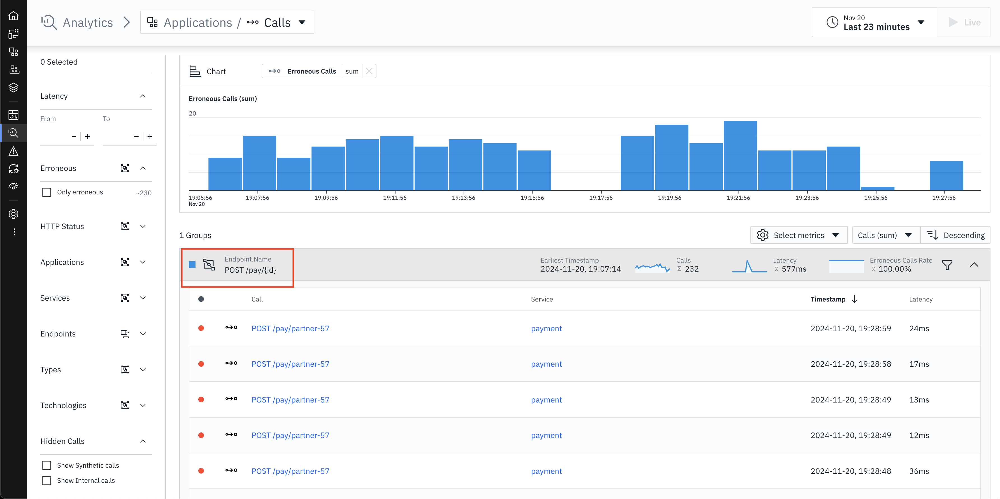

    The primary source of errors is starting to become apparent.

31. **Click the Events option in the left side menu. Click the Incidents tab if you aren't automatically taken there.**

    Instana can parse all of the requests, calls, traces, and other information into a stream of events and then classify and group them. Instana includes built-in events, predefined health signatures based on integrated algorithms which help you to understand the health of your monitored system in real-time. If a built-in event is not relevant for the monitored system, it can be disabled. Conversely, you can create a custom event in Instana if it does not already exist. These events can then be sent as an alert to a channel of your choice, such as email, Slack, AIOps, Splunk, PagerDuty, Prometheus, a generic webhook, or one of many more supported technologies.

    Right now you're looking at Incidents that Instana has identified during the timeframe. Incidents are created when a key performance indicator such as load, latency, or error rate changes over a certain threshold.

32. **Select the Issues tab.**

    

    An issue is an event that is triggered if something out of the ordinary happens. You can think of Incidents as Issues that Instana has correlated with each other to form a cohesive event.

### Using Instana to Identify a Problem

As you looked through the various sections of the Instana dashboard, a few errors kept popping up. In this section, you will use Instana to pinpoint the root cause of the errors and fix them. When debugging with Instana, a good place to start is Events.

33. **Back on the Incidents tab, click one of the Incidents titled "Erroneous call rate is too high".**

    

    The incident page shows a dynamic graph of all associated issues, events, and correlates it with other incidents to provide a comprehensive overview of the situation regarding service and event impact.

34. **Click to expand the triggering event.**

    

    Instana automatically displays a relevant dynamic graph. In this case, it is the erroneous call rate for the payment service. Instana also provides a link to the analysis page for these calls.

35. **Click the "Analyze Calls" button.**

    Now you're back on the Analysis page you looked at previously, but with the correct filters automatically applied. You can see that the `POST /pay/{id}` endpoint has 100% erroneous calls. Click to expand that dropdown.

    

    Notice how the same information about the erroneous calls for `POST /pay/partner-57` is displayed as it was previously, but Instana did all of the filtering. Because of the 100% error rate, it's clear that this endpoint is having an issue. Instana also provided links to the specific calls that failed.

36. **Click one of the "POST /pay/partner-57" links.**

    

    On the call page, you see how many instances of the erroneous call there are, a trace of the call and at which point the error occurred, the status code and error messages received, and more. From reading through the information on this page, it's apparent that the source of the error is the `payment` service in Kubernetes. The related endpoints and infrastructure such as the MongoDB and the `user` service look healthy.

37. **Click the "payment" link under "Service Endpoint List".**

    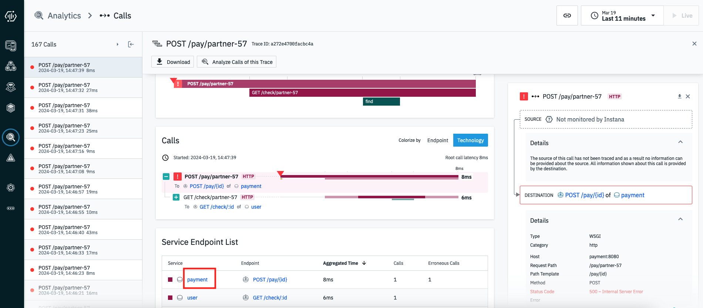

    Again you can confirm that the payment service in OpenShift is the cause of these Incidents. At this point you would want to look at the Kubernetes YAML definitions and the python code that was containerized and is running this microservice. For the sake of this demonstration, the error is caused by an intentional bug built into the load generator which is attempting to access a payment endpoint that does not exist.

### Instana Wrap-up

You should now have a better understanding of Instana observability, how to use the platform, and the IBM Z data and metrics it can observe. The observability provided by Instana set the stage for other IBM solutions to **use that data** to make AI-driven insights around application performance and problem remediation.

## Turbonomic

### Overview of Turbonomic Application Resource Management 

Turbonomic is IBM's Application Resource Management (ARM) solution for cloud and on-premises environments.

Application Resource Management platforms continuously analyze applications' resource needs and generate fully automatable actions to ensure applications always get what they need to perform.

Turbonomic enables environments to achieve the following conflicting goals at the same time:

- *Assured application performance*: Prevent bottlenecks, upsize containers/VMs, prioritize workload, and reduce storage latency.

- *Efficient use of resources*: Consolidate workloads to reduce infrastructure usage to the minimum, downsize containers, prevent sprawl, and use the most economical cloud offerings.

You configure managed environments as [Turbonomic targets](https://www.ibm.com/docs/en/tarm/8.10.3?topic=overview-turbonomic-targets). Turbonomic discovers the entities (physical devices, virtual components and software components) that each target manages, and then performs analysis, anticipates risks to performance or efficiency, and recommends actions you can take to avoid problems before they occur.

[Source and more information](https://www.ibm.com/docs/en/tarm/8.11.5?topic=documentation-product-overview)

### Navigating the Turbonomic Dashboard

#### Homepage

38. **Navigate to the Turbonomic platform home page.** You can find the console link and your credentials in the [access.md](access.md) file.

    Because you are logged in as a user with "Advisor" credentials, you can see everything that Turbonomic is managing, but you cannot take actions against the target environments or modify the Turbonomic server itself. You could set up more users either locally on the Turbonomic server or with an authentication such as LDAP. These new users can have their access scoped to certain environments, applications, or specific entities on the Turbonomic server so people can only access what they need to.

    

    The first thing to notice is the supply chain on the left side of the page. Turbonomic uses the concept of a supply chain made up of buyers and sellers all with the goal of meeting application resource demand. The supply chain shown on the homepage includes all the entities that Turbonomic identified based on deployment of the KubeTurbo operator on the OpenShift on IBM Z cluster. The relationships and interdependencies between each entity were automatically identified and provide an overview of how each object relates to one another. Because an OpenShift cluster is being monitored, you can see application and cluster infrastructure components were found including containers, namespaces, persistent volumes, and the single virtual machines running the OpenShift nodes. This is an interactable chart so you can click on any of the entity types to drill down directly from the homepage.

    

    On the right side of the page, you can see there is a "Business Application" listed with the name `Robot Shop Microservices Application`. A Business Application is a Turbonomic concept defined by a group of related objects of your choosing. In the case of this demonstration, Business Applications are imported from the Instana Application Perspectives, as well as all the related entities that Turbonomic correlated with them, such as the virtual machine the pods are running on, the namespace (project) they're running in, the persistent volumes where they store data, and the Kubernetes cluster itself. This is one example of the integration between Instana and Turbonomic.

    Instana working alongside Turbonomic brings other benefits as well, such as letting Turbonomic see the application response times and transaction speeds and then use that data to horizontally scale pod counts to meet defined Service-Level Objectives (SLOs). Without Instana or another Application Performance Monitoring (APM) solution in place, you would not have any visibility into application response times or metrics, and this Turbonomic functionality would be inaccessible.

    

    Near the middle of the page, you will see a section titled "Pending Actions". These are all the actions that Turbonomic is recommending you take to make sure applications get the resources they need without over-provisioning. You will learn more about actions later in this tutorial.

#### Search

39. **In the left side menu, select the Search option.** 

    On the search page, you can filter down to specific types of entities that Turbonomic has identified. For example, if you look at Namespaces, it will return all the namespaces, or projects in OpenShift nomenclature, in the target cluster.

40. **Select the Namespaces option in the list.**

    

    Next you will dig into the namespace that contains the Robot Shop sample application.

41. **Select the `robot-shop` namespace.**

    

    You now have a view that is scoped to only the components running in the robot-shop namespace, as well as any related components that those pods interact with, such as virtual machines, storage volumes, etc. You are provided all the actions against these components, the top services and workload controllers by CPU and memory for the robot-shop components, information about any quotas assigned to the project, and more. If you want to scope down an individual's access to a single application, only workloads in a specific datacenter, or a custom group of workloads and components you define, this is an example of what that could look like.

### Turbonomic Actions

#### What are Actions?

After you deploy your targets, Turbonomic starts to perform analysis as part of its Application Resource Management process. This holistic analysis identifies problems in your environment and the actions you can take to resolve and avoid these problems. Turbonomic then generates a set of actions for that particular analysis and displays it in the Pending Actions charts.

[Source and more information](https://www.ibm.com/docs/en/tarm/8.10.3?topic=started-turbonomic-actions)

#### What Actions are Available for OpenShift on IBM Z Targets?

For OpenShift on IBM Z, Turbonomic can generate the following actions:

<details>
  <summary>Vertically Scale Containers - resize container spec sizes (click to expand)</summary>
  
If a containerized application needs more CPU or memory to ensure it's running with desired performance, Turbonomic can scale up the container spec. In OpenShift terms, this means adjusting the resource requests and/or resource limits applied to the application pods. The reverse is also important - if a container is overprovisioned - it has too much CPU or memory assigned to it - these resources are going to waste. Overprovisioning is a common issue in the containerized world, and it leads to inefficient use of resources, lack of resources for other applications that need it, and wasted money.

</details>

<details>
  <summary>Horizontally Scale Containers - Scale up the number of pods for a microservice (click to expand)</summary>
  
If there is a Service Level Objective (SLO) configured for a containerized application, Turbonomic can scale the number of pods up or down in order to meet the demand at any given moment.

An APM solution such as Instana is required for this action type. Turbonomic needs metric data from the APM about response time and transactions speeds in order to enforce SLOs.

</details>

<details>
  <summary>Pod Moves - move a pod from one node to another (click to expand)</summary>
  
Turbonomic continuously moves pods based on node resources available. The moves are performed in a way that keeps the application available throughout the move. Once executed, Turbonomic will start a new pod on the destination node -> ensure that it is running and ready -> deletes the original pod. This way, there is no perceived downtime to the application end user.

</details>
    
<details>
  <summary>Cluster Scaling - Provisioning or Suspending OpenShift Nodes (click to expand)</summary>
  
Turbonomic will also generate actions to create new nodes in the OpenShift cluster or suspend existing nodes based on its analysis of efficiency (consolidating workloads onto fewer nodes) and performance (avoiding node congestion).

For OpenShift on IBM Z, Turbonomic will only *recommend* actions related to cluster scaling. Turbonomic relies on OpenShift machine autoscaling which is not supported on IBM Z. Therefore, if a node provision/suspension action is generated for an IBM Z cluster, administrators will need to perform that action themselves with manual methods and then Turbonomic will see that change.

</details>

#### Manually Executing Actions

As you saw throughout the tour of the Turbonomic platform, there pending actions related to some sample applications running on the IBM Z cluster.

47. **In the OpenShift console, navigate to your `userNN-project`, click the icon for the NodeJS application, click the Actions dropdown, and then select Edit Resource Limits.**

    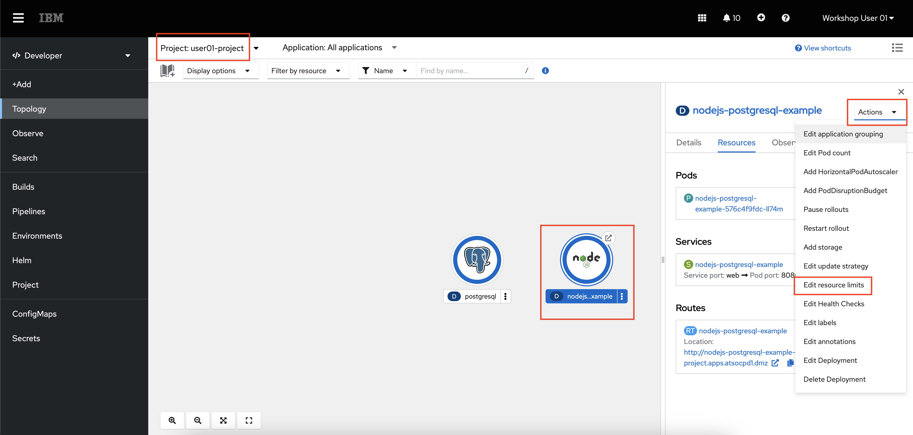

    These are the default NodeJS application resources. *Requests* are the amount of CPU and memory a container is guaranteed to get. *Limits* are the maximum amount of resources a container can use before they are restricted.

    

    The defaults for the NodeJS application are intentionally suboptimal in order to generate recommended actions in Turbonomic.

48. **In the Turbonomic console, log OUT of your `userNN` username using the button in the bottom-left corner of the menu.**
    
49. **Log back in to Turbonomic with the new username: `userNN-actions` and the same password as before.**

    This username has permissions to execute actions against a sample application in the `userNN-project` namespace. 

    Because this username is scoped to only the `userNN-project` namespace, that is all you can see.

50. **From the home page, click the userNN-project Business Application.**

51. **Click the Pending Actions just to the right of the supply chain chart.**

    

    The action(s) here are related to the microservices in the userNN-project. You should have actions related to CPU and/or memory resizing for the NodeJS frontend application and/or the Postgres backend database.

52. **Click the details button to far right of the `nodejs-postgres-example` action to drop down more details.**

    

    Here you see more details about exactly what Turbonomic is recommending you do via the action. It includes resizing both CPU and memory limits for the pod, and you can see the result that Turbonomic expects in terms of CPU throttling and resource utilization as a percentage of CPU and memory limits.

    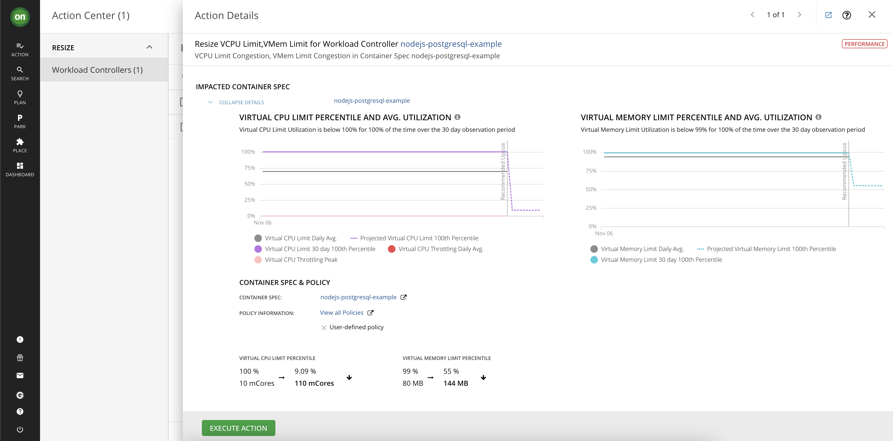

    Because this is a manual action (rather than Recommended) you are provided with a button in the user interface to directly execute the action and make the proposed changes. Because you are logged in with credentials scoped to this namespace, you can execute the action. If you were logged in with your `userNN` advisor credential, you would not be able to execute the action.

53. **Click the green Execute Action button.**

    Turbonomic will apply the recommended changes to the NodeJS application running on OpenShift. You can see the executed action in the `userNN-project` business application "All actions" panel.

    

54. **In the OpenShift console, refresh the page and navigate back to the `nodejs-postgres-example` resource limits to see the new values.**

    

    Although this type of manual action with human review and execution is extremely helpful for reducing the amount of time and thought put into container resizing, the goal of AIOps solutions is to *automate* as many of these processes as possible. Turbonomic supports automatic executiion of actions.

    For example, the Robot Shop application containers are resized on a daily basis. The schedule for automated actions can be determined by operations teams. As Turbonomic learns more about the application, its performance, and the impact of the actions it executes, it will adjust accordingly to ensure that each pod has enough CPU and memory to perform well, but not so much that the resources are going to waste.  

### Turbonomic Wrap-up

In this section, you have seen some of the capabilities of Turbonomic Application Resource Management of an OpenShift on IBM Z cluster. Turbonomic has many more capabilities that were not covered in this demonstration, which you can read more about in the [Turbonomic Documentation](https://www.ibm.com/docs/en/tarm/8.10.3?topic=documentation-getting-started) as well as in this [IBM article](https://developer.ibm.com/articles/understanding-application-resource-management-using-turbonomic/).

## IBM Cloud Pak for AIOps

### Introduce an Error into your Sample Application

In the following section, you will be using IBM Cloud Pak for AIOps to solve an issue in the NodeJS and Postgresql sample application running in the `userNN-project` OpenShift namespace. In this section, you will introduce the error so you can solve it later.

55. **In the OpenShift console under the developer perspective, navigate to your `userNN-project` namespace topology, click the Postgresql icon, then click the `postgresql` deployment hyperlink.**

    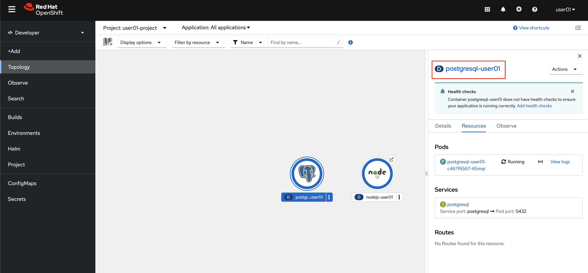

56. **Under the Environment tab, change the value for `POSTGRESQL_DATABASE` from `my_data` to `my_data-error`. Click save at the bottom of the page.**

    

    Your NodeJS pod will shortly become unready as it is no longer able to find the correct Postgresql database.

57. **Try to access the frontend application with the small hyperlink button on the NodeJS icon.**

    

    You should receive an error page similar to the following:

    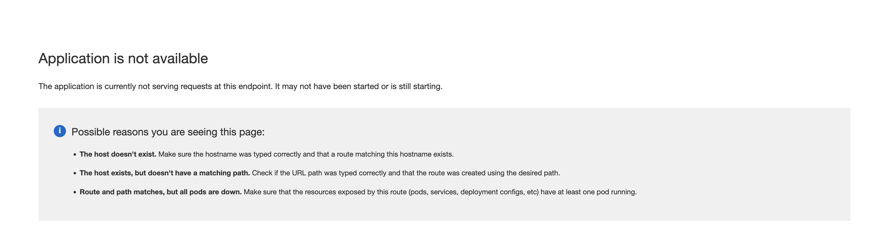

    Once you see this error message, proceed to the next section.

### Overview of IBM Cloud Pak for AIOps

IBM Cloud Pak for AIOps is a platform that deploys advanced, explainable AI using your organization's data so that you can confidently **assess, diagnose, and resolve incidents** across mission-critical workloads and **proactively avoid incidents and accerlate your time to resolution**.

IBM Cloud Pak for AIOps helps you **uncover hidden insights from multiple sources of data**, such as logs, metrics, and events. It then **delivers those insights directly into the tools that your teams already use**, such as Slack or Microsoft Teams, in near real-time.

### Exploring the CP4AIOps Console

58. **Navigate to your IBM Cloud Pak for AIOps dashboard.** You can find this address in the [access file](./access.md).

    

59. **In the dropdown for `Log in with`, make sure you have `OpenShift Authentication` selected, then select the `ldap-ats-wscdmz-wfwsldapcl01` option, and log in with your OpenShift credentials (i.e. `userNN`).** Do not select the `kube:admin` option.

    

    When you first open CP4AIOps, you are taken to the homepage that displays the most important information that you have access to. Depending on your credentials, different "widgets" will appear for you to see and act on.

    The terms and concepts on this homepage may seem foreign at first, but they will become clear throughout the rest of this tutorial. A good place to start is on the AIOps Insights page where you can see an overview of the CP4AIOps benefits.

#### AIOps Insights

60. **Expand the menu by clicking the button in the top-left corner of the page, then navigate to the AIOps Insights page.**

    

    On this page, you see visualizations of two of the main goals of CP4AIOps - Improved Mean Time to Restore (MTTR) and Reduction of Noise.

    **Mean Time to Resolution (MTTR)** is the total time period from the start of a failure to resolution. For business-critical applications, downtime of just a few minutes can mean thousands or millions of dollars' worth of lost revenue. IBM Cloud Pak for AIOps reduces MTTR by using AI-driven insights to recommend actions and runbooks to solve the issue more quickly.

    **Noise Reduction** is the concept of reducing the number of IT events and alerts that your operations staff must evaluate, speeding recovery time and reducing employee fatigue.

    In the image above, over 300,000 events were narrowed down to 10,000 alerts, which were further narrowed down to 431 incidents. These incidents are what IT Operations staff needs to evaluate and remediate either through manual processes, or by building automation for repeating incidents.

    Next, you will take a look at where all of these events are coming from.

#### Data and Tool Connections

61. **From the left-side menu, navigate to Data and Tool Connections.**

    

    - All the data, events, and metrics you see in CP4AIOps are coming from the Instana server you explored earlier in this tutorial. 
    - Logs from select OpenShift applications are being forwarded to an [ELK server](https://www.elastic.co/elastic-stack) which is then ingested by CP4AIOps.
    - Slack is used for ChatOps to notify operations teams about incidents and ongoing remediation work.

    There are also two connections that you do not have visibility into - one for SSH connections, and one to an [Ansible Automation Platform](https://www.redhat.com/en/technologies/management/ansible) server. These are both used to take remediation actions against target environments.

#### Resource Management

62. **From the left-side menu, navigate to Resource Management.**

    

    Similar to Turbonomic, you will see that CP4AIOps integrated the Instana Application Perspectives.

63. **Click the link for the Robot Shop Microservices Application.**

    

    You now have a scoped view of just the resources associated with the Robot Shop Microservices Application - all of the Kubernetes objects such as pods, services, and routes, but also the individual application components within the containers such as `.jar` files and even the API calls made to each endpoint. 

#### Automations

64. **From the left-side menu, navigate to Automations**. If there are any filters applied, you can clear them by clicking the filter button and unchecking any that are applied.

    

    The automation tools - policies, runbooks, and actions - help you resolve incidents quickly by setting up and enabling an automatic response as situations arise.

    **Policies** are rules that contain condition and action sets. They can be triggered to automatically promote events to alerts, reduce noise by grouping alerts into an incident, and assign runbooks to remediate alerts.

65. **For example, find the Policy named `Robot Shop Erroneous Calls promote alert to incident`, and click it. In the new page that opens, click the "Specification" tab.**

    This policy looks for alerts that match the tags `Value of:alert.summary` contains `POST /pay/{id} - Erroneous call rate is too high`. An alert matching this tag will be sent from Instana when Instana determines there has been a significant increase in the rate of erroneous calls to the Robot Shop application.

    The policy also states what should happen when the policy finds a matching alert. In this case, it will promote the alert to an incident that will notify specific users responsible for fixing the issue, or potentially automatically run a runbook made up of one or more actions that have been defined in CP4AIOps.

66. **Navigate to the "Runbooks" tab on the Automations page.**

    

    **Runbooks** automate procedures thereby increasing the efficiency of IT operations processes. Runbooks are made up of one or more actions that can be taken against a target environment through either ssh or HTTP calls.

    You can also switch to the "Activities" tab to see all of the previous runbook usage.

67. **Navigate to the "Actions" tab on the Automations page.**

    **Actions** in runbooks are the collection of manual steps grouped into a single automated entity. An action improves runbook efficiency by automatically performing procedures and operations.

68. **For example, click the `Fix load deployment environment variable` action and then click the "Content" tab of the new window that pops up.**

    

    This action enables CP4AIOps to `ssh` to a target server and run the proper `oc` commands to solve the issue.

    There are other alternatives to `ssh` - for example, HTTP API calls or Ansible automation playbooks.

    Runbooks and actions can be associated with incidents so that whenever an incident is created that meets certain criteria, a runbook can automatically kick off problem remediation.

#### Incidents and Alerts

70. **In the left-side menu, navigate to "Incidents".**

    
    
    Depending on what alerts are triggered at the time you go through the tutorial, the current incidents will look different.

    Incidents are where the IT Operators and administrators should focus their attention to either manually close incidents as they are generated or build actions and runbooks in order to remediate incidents automatically as they appear. 

71. **Find the incident that begins with `userNN-project/nodejs-postgresql-example`, where `userNN` is your user number.**

    ***Please be careful to select your correct incident. There is nothing stopping you from accidentally selecting another user's incident and closing it in the coming steps.***

    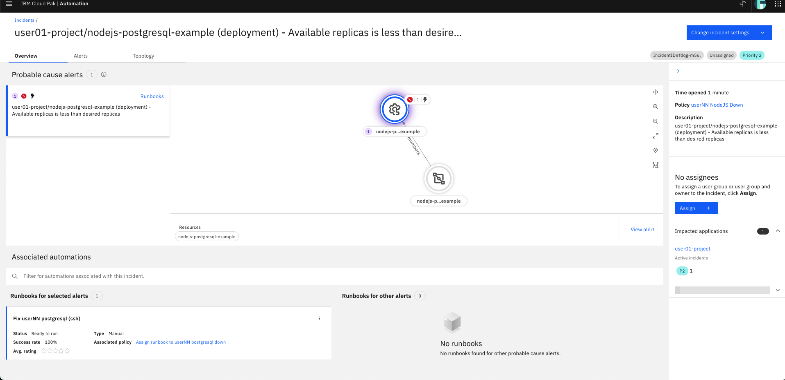

    The incident contains many pieces of information that can be used to more quickly remediate issues.

    - *Probable cause alerts* - CP4AIOps attempts to derive the root fault component, and the full scope of components that are affected by an incident
    - *Topology* - provides a view of the affected components so IT Operators can see the incident in context
    - *Assignees* - you can either manually assign incidents to team members to resolve, or CP4AIOps can assign people or teams automatically if a policy is configured to do so
    - *Impacted Applications* - any business applications that CP4AIOps identifies as impacted by the incident
    - *Recommended runbooks* - if CP4AIOps correlates the incident with others from the past that were resolved with certain playbooks, they will be recommended

72. There seems to be a problem with the NodeJS and Postgresql application running in your `userNN-project` OpenShift project. **Navigate to the OpenShift console in the developer perspective and try to access the frontend application with the small hyperlink button on the NodeJS icon.**

    

    You should receive an error page similar to the following:

    

    Cloud Pak for AIOps has identified this error as an *incident*, and has provided a runbook to fix it.

73. **Back in the CP4AIOps incident in the bottom of the page, click the three dots associated with the `Fix userNN postgresql (ssh)` runbook, then select `Run`.**

    

    This *runbook* is made up of three separate *actions*. Each action is a bash command issued through an SSH connection. It is not required that all commands be of the same type. For example, one step could be a bash command while the second could be an Ansible playbook or an API call.

    - First, the runbook will log into the OpenShift cluster from an Ubuntu server via an SSH connection.
    - Second, it will check if the `POSTGRESQL_DATABASE` environment variable is properly set.
    - Third, it will remediate the error. The remediation for this error is to edit the Postgresql deployment's environment variable to the correct database name of `my_data`, rather than `my_data-error`.
    - Finally, it will check the environment variable again to confirm that it was properly changed.

74. **Start the runbook by entering the variables for your `openshift username` and `openshift password`.**

    - openshift username: `userNN` (where `NN` is your user number, same as `user`)
    - openshift password: your OpenShift password found in the [access.md](access.md) file

75. **After populating the variables, click *Start Runbook* at the bottom of the page.**

    You can now click the smaller *Run* buttons to manually run each step in the runbook.

76. **Click through each step in the runbook**, waiting for each step to show as **completed** before moving on.

    

    If the output of step 4 includes the return `POSTGRESQL_DATABASE=my_data`, the application issue should be fixed.

    You can give the runbook a 1-5 star rating, leave a comment, and mark that it worked. This will provide feedback to the automation engineers and AI algorithms so that runbooks can continue to improve.

77. **In the OpenShift console, navigate back to your `userNN-project` in the developer view. Access your frontend application by clicking the hyperlink button attached to the NodeJS application.**
   
    

    Because the NodeJS application can now reach the Postgresql database, the application is accessible and you can enter fruit quantities into the inventory database using the webpage.

    

    As you interact with the application, you will be able to see the resulting calls and traces in the `userNN-project` Instana application perspective. You should also see that 200 status calls have returned.

    

    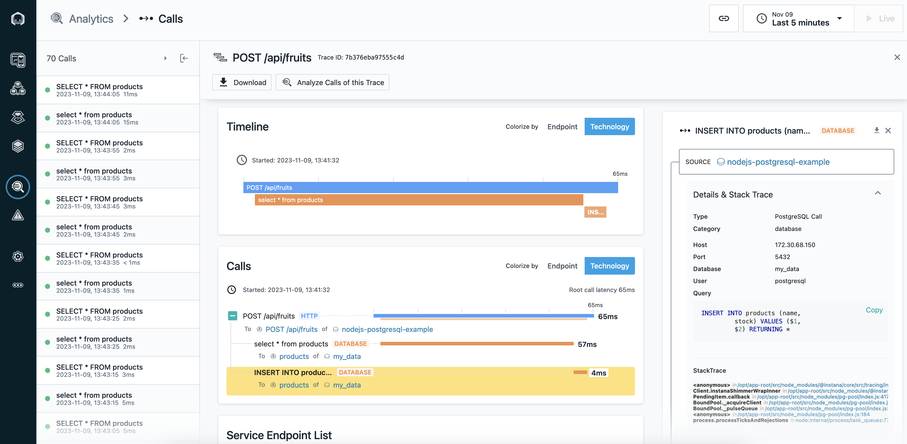

    In CP4AIOps, you can either manually mark your incident as *resolved*, or you can let CP4AIOps identify that the error has been fixed and it will close the incident automatically.

#### AI Model Management

Throughout this tutorial, you have been interacting with alerts, incidents, and policies that have been generated or influenced by AI algorithms that are running and training in CP4AIOps This section will show you the AI models that come pre-loaded with CP4AIOps and the benefits they provide.

78. **From the left-side menu, navigate to "AI Model Management".**

    

    This page allows you to train the pre-loaded AI models to hone their ability to derive insights from your incoming data connections (Instana in this tutorial). 

    For example, the *Temporal grouping* AI model groups alerts which co-occur over time. When a problem arises, there are typically multiple parts of a system or environment that are impacted. When alerts in different areas co-occur, it makes sense to look at them together and treat them as one problem to try and determine what might have happened. This is one of the ways that noise is reduced from the hundreds of thousands of events all the way down to a few hundred incidents.

79. **Click the "Temporal grouping" tile.**

    

    You can see the status and history of the AI model training as well as the applications that it is being applied to. Users with elevated credentials are able to manually kick of training to improve the AI model, as well as set up a schedule to automate training on a consistent basis.

## Wrapping Up

In this demonstration, you have seen some of the capabilities of IBM's AIOps portfolio and how it can observe and manage IBM Z applications and infrastructure.

With Instana, Turbonomic, and IBM Cloud Pak for AIOps, you can keep your applications up and running, meeting your SLAs, and when incidents do arise, you can remediate them quickly and get back to focusing on other projects.

We encourage you to look through the references below and reach out to this [tutorial author](mailto:matt.mondics@ibm.com) if you would like to see or learn more.

## References

- [Instana Product Page](https://www.ibm.com/products/instana)
- [Turbonomic Product Page](https://www.ibm.com/products/turbonomic)
- [IBM Cloud Pak for AIOps Product Page](https://www.ibm.com/products/cloud-pak-for-aiops)

- [Instana Documentation](https://www.ibm.com/docs/en/instana-observability/current)
- [Turbonomic Documentation](https://www.ibm.com/docs/en/tarm)
- [IBM Cloud Pak for AIOps Documentation](https://www.ibm.com/docs/en/cloud-paks/cloud-pak-aiops)

- [Instana Supported Technologies](https://www.ibm.com/docs/en/instana-observability/current?topic=configuring-monitoring-supported-technologies)
- [Turbonomic Integrations](https://www.ibm.com/products/turbonomic/integrations)
- [IBM Cloud Pak for AIOps Integrations](https://www.ibm.com/docs/en/cloud-paks/cloud-pak-aiops/4.4.1?topic=integrations-integration-types)