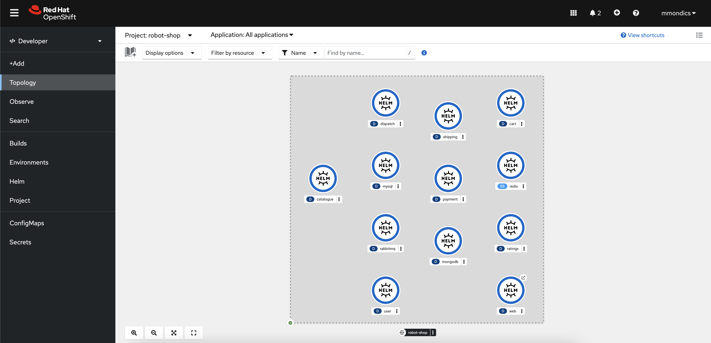
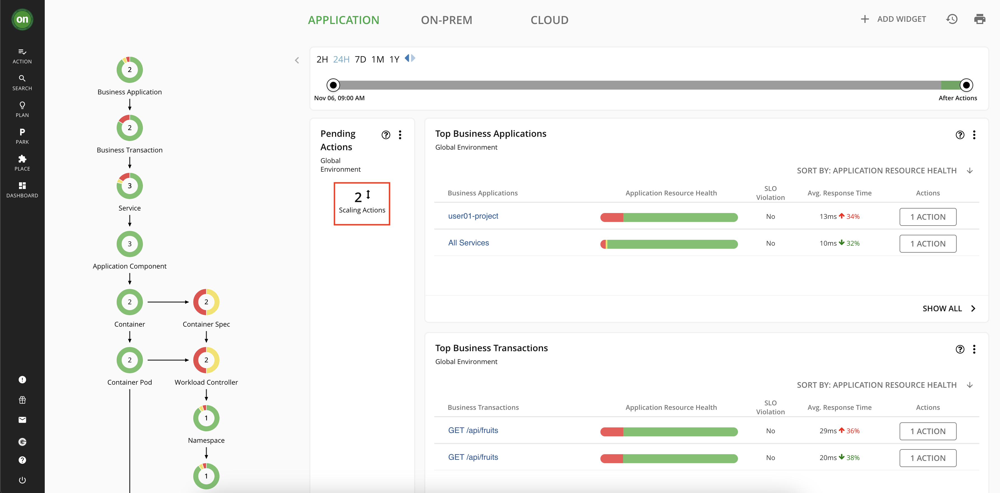
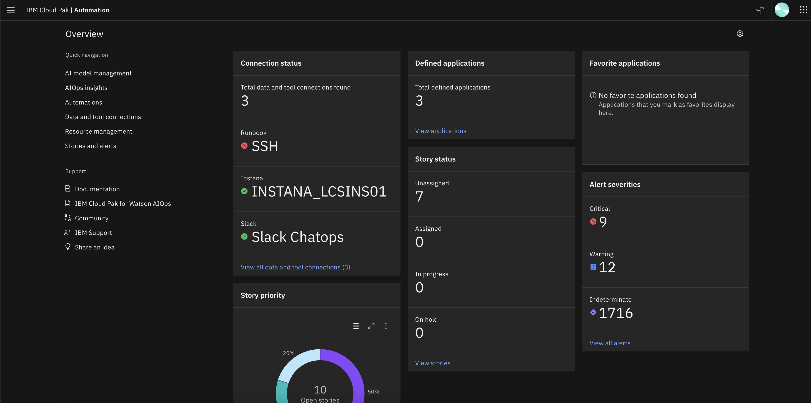

# AIOps with IBM Z and LinuxONE

In this tutorial, you will walk become familiar with IBM's three strategic AIOps solutions - Instana, Turbonomic, and IBM Cloud Pak for AIOps - and the capabilities they have to monitor and manage IBM Z applications and infrastructure.

## Environment Overview


## Connecting to the Lab Environment

Connection instructions with platform URLs and credentials are listed in the [access file](/access.md).

## Exploring the Robot Shop Sample Application

1. **Open a web browser such as Firefox.**

2. In the browser, **navigate to your OpenShift console.** 

    The OpenShift console typically begins with `https://console-openshift-console-`. You can find this in the [access file](/access.md). Reach out to your OpenShift administrator if you do not have this address.

    You will now see the OpenShift console login page.

    

3. **Log in with your OpenShift credentials.**

4. **Under the developer perspective, navigate to the Topology page for the `robot-shop` project.**

    

    Robot Shop is a simulated online store where you can purchase robots and AI solutions. Robot Shop is made up of many different microservices that are written in different programming languages. There are 12 different microservices written in languages including NodeJS, Python, Spring Boot, and Go, along with containerized databases including MongoDB, MySQL, and Redis. Each icon in the Topology represents an OpenShift deployment for a specific microservice. Each microservice is responsible for a single function of the Robot Shop application that you will see in the following steps.

5. **Open the Robot Shop web application by clicking the small button in the top right of the `web` icon.**

    This is simply a hyperlink that will take you to the Robot Shop application homepage.

    

    The Robot Shop homepage should appear like the screenshot below, with all of the same options in the left side menu.

    

6. **Explore the website and its functionalities from the left side menu.**
   
    You can register a new user, explore the catalog of purchasable robots, give them ratings, and simulate a purchase.

    Notice that from the OpenShift and Robot Shop perspectives, you don't get much of a sense of how the various microservice applications are plumbed together, how they are performing, if they have the correct amount of resources, or if any issues are affecting the application currently. In other words, there is a lack of *observability*, *application performance management*, and *proactive problem remediation*.

## Instana

### Overview of Instana Observability

Instana is an enterprise observability solution that offers application performance management - no matter where the application or infrastructure resides. Instana can monitor both containerized and traditional applications, various infrastructure types including OpenShift, public clouds & other containerization platforms, native Linux, z/OS, websites, databases, and more. The current list of supported technologies can be found [in the Instana documentation](https://www.ibm.com/docs/en/instana-observability/current?topic=configuring-monitoring-supported-technologies).

### Viewing the Instana Agent on OpenShift

7. In the OpenShift cluster, **navigate to the `instana-agent` project then click the circular icon in the Topology page.**

    

    This is the Instana agent that is collecting all the information about OpenShift and the containerized applications running on it and sending that information to the Instana server.
    
    The agent is deployed as a [DaemonSet](https://kubernetes.io/docs/concepts/workloads/controllers/daemonset/), which is a Kubernetes object that ensures one copy of the pod runs on each compute node in the cluster. Each individual Instana agent pod is responsible for the data and metrics collection for the compute node it runs on.

8. **Click the `view logs` hyperlink next to one of the pods in the right-side menu.**

    ```text
    2023-03-01T17:13:46.589+00:00 | INFO | stana-agent-scheduler-thread-9-1 | turesManagerImpl | com.instana.agent-bootstrap - 1.2.25 | Installed instana-kubernetes-sensor
    2023-03-01T17:13:46.593+00:00 | WARN | stana-agent-scheduler-thread-9-1 | yDiscoveryTicker | com.instana.agent - 1.1.677 | Discovery for com.instana.plugin.kubernetes took too long (28512 ms)
    2023-03-01T17:13:46.608+00:00 | INFO | 7c9-865d-446b-8ad9-ada0c5fb7a59) | Kubernetes | com.instana.sensor-kubernetes - 1.2.139 | Activating Kubernetes Sensor
    2023-03-01T17:13:46.662+00:00 | INFO | 7c9-865d-446b-8ad9-ada0c5fb7a59) | Kubernetes | com.instana.sensor-kubernetes - 1.2.139 | Using master url https://172.30.0.1:443/
    2023-03-01T17:13:47.152+00:00 | INFO | 7c9-865d-446b-8ad9-ada0c5fb7a59) | Kubernetes | com.instana.sensor-kubernetes - 1.2.139 | Subscribed to leadership events
    2023-03-01T17:13:47.997+00:00 | INFO | tana-sensor-scheduler-thread-2-2 | ableResourceInfo | com.instana.sensor-kubernetes - 1.2.139 | Start watching pods on node compute-0.atsocpd1.dmz...
    2023-03-01T17:13:50.950+00:00 | INFO | stana-agent-scheduler-thread-9-1 | turesManagerImpl | com.instana.agent-bootstrap - 1.2.25 | Installed instana-host-sensor
    2023-03-01T17:13:51.080+00:00 | INFO | 74c-6ecc-49c2-995a-e57f52e12cdb) | Host | com.instana.sensor-host - 1.1.147 | Activated Sensor
    2023-03-01T17:13:53.975+00:00 | INFO | stana-agent-scheduler-thread-9-1 | turesManagerImpl | com.instana.agent-bootstrap - 1.2.25 | Installed instana-gcp-services-discovery
    2023-03-01T17:13:53.984+00:00 | WARN | stana-agent-scheduler-thread-9-1 | yDiscoveryTicker | com.instana.agent - 1.1.677 | Discovery time (58652 ms)
    2023-03-01T17:14:15.061+00:00 | INFO | c66-b1ef-4bc0-bc2a-b810abc8cdd3) | Crio | com.instana.sensor-crio - 1.0.10 | Activated Sensor 7f31b2cbe57b25720a4faf38ca86003fbd940c86d56cf02f78ed752d5e409dcd
    2023-03-01T17:14:15.105+00:00 | INFO | 8f9-dbcf-4c46-b04d-f396b7f048a2) | Crio | com.instana.sensor-crio - 1.0.10 | Activated Sensor 5aac7fe96187321e5302478dbfc64feda35d108e59b6c3dc0c42f094435ecd7b
    2023-03-01T17:14:15.110+00:00 | INFO | 61d-5569-47e8-9196-8128bb8944c5) | Crio | com.instana.sensor-crio - 1.0.10 | Activated Sensor 7034d4698290b57385bcc5a85fca3faa4fd0605a24046ac15b4bd6c9a436813a
    2023-03-01T17:14:15.115+00:00 | INFO | c3b-a47a-4856-acef-c8a8b8d3882a) | Crio | com.instana.sensor-crio - 1.0.10 | Activated Sensor 3dbe00e2b1da3d427deaaa9321ef3ad88ba5fecd6eac47483da89e4a50375ab5
    2023-03-01T17:14:15.207+00:00 | INFO | 0c7-c787-45c4-912d-dd8f93c24d66) | Crio | com.instana.sensor-crio - 1.0.10 | Activated Sensor e49ed98a6c4cf6271d009488d9292858912602915af4be8772664d24d4f36f68
    2023-03-01T17:14:15.253+00:00 | INFO | ab0-768f-42e8-a27b-96f4f149b22d) | Crio | com.instana.sensor-crio - 1.0.10 | Activated Sensor 3268dbca7f621f728066d2e0d73bc5cdc803f3ea218e49d997bcb4519f2058df
    ```

    If you would like to see what data the agents are collecting or if you need to debug issues with collecting data from certain workloads running on OpenShift, these pod logs are a good first place to look.

    In the next section, you will take a look at the other side of the OpenShift Instana agent - the Instana server that is receiving the data.

### Navigating the Instana Dashboard

9. **In a web browser, navigate to your Instana server. Reach out to your Instana administrator if you do not have this address.**

10. **Log in with your Instana credentials.**

    When you first log into Instana, you will be taken to the Home Page. This is a customizable summary page that shows the key metrics for any component of your environment in the timeframe specified in the top right of the screen.

    

11. **Set the time frame to Last Hour and click the Live button.**

    You are now seeing metrics for our environment over the previous hour, and it is updating in real time with up to 1 second granularity and no sampling.

    The next thing to notice is the menu on the left side of the page. If you hover over the left side panel, you will see a menu of links that will let you dive into different sections of the Instana dashboard, rather than seeing every option.

12. **Click the left side panel so the menu appears.**

    

    Next, you will go through each section in the menu.

13. **Click the Websites & Mobile Apps option.**

    

    You can see that Instana is monitoring one website named `Robot Shop Website`. This is the set of webpages associated with the Robot Shop sample application we have deployed on OpenShift on IBM Z. Instana supports website monitoring by analyzing actual browser request times and route loading times. It allows detailed insights into the web browsing experience of users, and deep visibility into application call paths. The Instana website monitoring solution works by using a lightweight JavaScript agent, which is embedded into the monitored website.

14. **Click the Robot Shop Website hyperlink.**

    

    If the page is empty, navigate back to the Robot Shop website from the OpenShift topology page and click around the site to generate data.

    After interacting with the webpages, we now see metrics for page loads and transitions, loading times, any errors, and many more performance indicators. Within this website, there are all kinds of filters and tabs with more information.

15. **Navigate through the various tabs to show more data - Speed, Resources, HTTP requests, and Pages.**

    What we've seen so far is all related to the *website* metrics, not the *application* itself. In the next section, we will dig into how the application on OpenShift on IBM Z is running.

16. **Click the Applications option in the left side menu.**

    

17. **Click the Robot Shop Microservices Application hyperlink.**

    An application perspective represents a set of services and endpoints that are defined by a shared context and is declared using tags. For example, in this tutorial, the Robot Shop Microservices application perspective encompasses all services and endpoints that meet the tag `kubernetes-namespace=robot-shop`.

    Alongside the Robot Shop application running in OpenShift, there is a container running a Python application that generates load to each microservice. The metrics you see now in the application perspective are coming from that load generator. At the top of the page, you can see the total number of calls, the number of erroneous calls, and the mean latency for each call over the past hour. Each chart can be interacted with in various ways. For example, the total calls graph can be filtered by return code.

18. **Click to hide each return code other than `500`.**

    

    As with the Websites & Mobile Applications section, the Application perspective has various tabs that contain different information. When it comes to microservices, one of the most helpful tabs in the Application perspective is the Dependency graph.

19. **Click the Dependencies tab.**

    

    The dependency graph offers a visualization of each service in the Application perspective, which services interact with each other, and visual representations of errors, high latency, or erroneous calls. You can select these options in the top left of the graph.

20. **Click the dropdown labeled None and select Max Latency.**

    

    You can now see that the cities microservice is the largest contributor to application latency. There are more tabs in the Application perspective related to each individual service, error and log messages, the infrastructure stack related to the tag we specified, and options to configure the Application perspective.

21. **Click through each of the tabs.**

    If you pay attention while clicking through these tabs, you will notice that the payments service has an unusually high number of erroneous calls, but we'll get to that in a later section.

22. **Click the Platforms -> Kubernetes option in the left side menu.**

    

23. **Click the atsocpd1 (cluster) hyperlink.**

    OpenShift clusters are monitored by simply deploying a containerized Instana agent onto the cluster. Once deployed, the agent will report detailed data about the cluster and the resources deployed on it. Instana automatically discovers and monitors clusters, CronJobs, Nodes, Namespaces, Deployments, DaemonSets, StatefulSets, Services, and Pods.

    The Summary page shows the most relevant information for the cluster as a whole. The CPU, Memory, and Pod usage information are shown. The other sections, such as "Top Nodes" and "Top Pods" show potential hotspots which you might want to have a look at.

24. **Click the Details tab.**

    The Details tab displays information about the health of critical components of the Kubernetes cluster, such as the controller, scheduler, and etcd.

25. **Click the Events tab.**

    The Events tab shows all of the Kubernetes events in the cluster in real time. It also provides links to the related objects for quick access. The remaining tabs are Kubernetes objects in the cluster and the metrics displayed depend on the object type.

26. **Click through the tabs to show various objects and their metrics.**

    Instana also supports monitoring of Cloud Foundry and VMWare Tanzu clusters, but that is outside the scope of this demonstration.

27. **Click the Infrastructure option in the left side menu.**

    

    The Infrastructure map provides an overview of all monitored systems, which are initially grouped by options of your choice. Within each group are pillars comprised of opaque blocks. Each pillar as a whole represents one agent running on the respective system. Each block within a pillar represents the software components running on that system.

28. **With the filters in the bottom right of the page, select the Host Perspective and OS architecture for Grouping.**

    

    Now you are looking at the three monitored systems grouped by architecture. Each block within the pillars is a single process or microservice. Let's take a different look at the OpenShift cluster.

29. **Select the Container Perspective and Grouping by Kubernetes Namespace.**

    

    This is a better view of the containerized processes running in our monitored environment. As you might be able to tell by the color coding of the different processes or microservices, we have a few errors with the Robot Shop application. We'll come back to this page in a later section to debug.

30. **Click the Analytics option in the left side menu.**

    Instana analytics are integrated into each of the panels we've looked at so far, but you can also directly access them from the menu.

    

    By default, we're taken to a built-in dashboard for analytics related to Application calls. We can filter by using the left side options, or by creating our own filters at the top.

31. **Expand the left side options and select Only Erroneous and the Robot Shop Microservices application.**

    

    The source of some of our payment errors is starting to become apparent.

32. **Click the Events option in the left side menu. Click on Incidents if you aren't automatically taken there.**

    

    

    Instana can parse all of the requests, calls, traces, and other information about into a stream of events and then classify and group them. Instana includes built-in events, predefined health signatures based on integrated algorithms which help you to understand the health of your monitored system in real-time. If a built-in event is not relevant for the monitored system, it can be disabled. Conversely, you can create a custom event in Instana if it does not already exist. These events can then be sent as an alert to a channel of your choice, such as email, Slack, AIOps, Splunk, PagerDuty, Prometheus a generic webhook, or one of many more supported technologies.

    Right now we're looking at Incidents that Instana has identified during our timeframe. Incidents are created when a key performance indicator such as load, latency, or error rate changes over a certain threshold.

33. **Navigate back to the Events page and select the Issues tab.**

    

    An issue is an event that is triggered if something out of the ordinary happens. You can think of Incidents as Issues that Instana has correlated with each other to form a cohesive event. Let's take a look at a single Issue.

34. **Navigate back to the Events page and select the Changes tab.**

    

    A Change is an Event where Instana recognizes a change in configuration or status of a component it is monitoring, such as a deployment, pod, node, or server. Changes can be correlated with Issues under the umbrella of an Incident.

    This is the end of the navigation portion of this demonstration, so next we will start to put this knowledge to use. We just looked through a small portion of what Instana offers, but you now have a general sense of the capabilities Instana offers and how each is tied to one another through AI-driven algorithms and rules.

### Using Instana to Identify an Issue

As you looked through the various sections of the Instana dashboard, a few errors kept popping up. In this section, we will use Instana to pinpoint the root cause of the errors and fix them. When debugging with Instana, a good place to start is Events.

37. **Click the Events option in the left side menu. Click on Incidents if you aren't automatically taken there.**

    

    Instana has identified Incidents for us to look into.

38. **Click one of the Incidents titled "Erroneous call rate is too high".**

    

    The incident page shows a dynamic graph of all associated issues, events, and correlates it with other incidents to provide a comprehensive overview of the situation regarding service and event impact.

39. **Click to expand the triggering event.**

    

    Instana automatically displays a relevant dynamic graph. In our case, this is the erroneous call rate for the payment service. Instana also provides a link to the analysis page for these calls.

40. **Click the "Analyze Calls" button.**

    Now we're back on the Analysis page we looked at previously, but with the correct filters automatically applied. We can see that the POST /pay/{id} endpoint has 100% erroneous calls. Click to expand that dropdown.

    

    Notice how we see the same information about the erroneous calls for `POST /pay/partner-57` as we did previously, but Instana did all of the filtering for us. Because of the 100% error rate, it's clear that this endpoint is having an issue. Instana also provided us with links to the specific calls that failed.

41. **Click one of the "POST /pay/partner-57" links.**

    

    On the call page, we see how many instances of the erroneous call there are, a trace of the call and at which point the error occurred, the status code and error messages received, and more. From reading through the information on this page, we learn that the source of the error is the payment service in Kubernetes. The related endpoints and infrastructure such as the external MongoDB and the user service look healthy.

42. **Click the "payment" link under "Service Endpoint List".**

    

    Again you can confirm that the payment service in OpenShift is the cause of these Incidents. At this point we would want to look at our Kubernetes YAML definitions and the python code that was containerized and is running this microservice. For the sake of this demonstration, we know that the error is caused by an intentional bug built into the load generator which is attempting to access a payment endpoint that does not exist.

### Instana Wrap-up

You should now have a better understanding of Instana observability, how to use the platform, and the IBM Z data and metrics it can observe. The observability provided by Instana set the stage for other IBM solutions to **use that data** to make AI-driven insights around application performance and problem remediation.

## Turbonomic

### Overview of Turbonomic Application Resource Management 

Turbonomic is IBM's solution for Application Resource Management (ARM) for both cloud and on-premises environments.

Application Resource Management is a top-down, application-driven approach that continuously analyzes applications' resource needs and generates fully automatable actions to ensure applications always get what they need to perform. It runs 24/7/365 and scales with the largest, most complex environments.

Turbonomic enables environments to achieve the following conflicting goals at the same time:

- Assured application performance
        
    Prevent bottlenecks, upsize containers/VMs, prioritize workload, and reduce storage latency.

- Efficient use of resources
    
    Consolidate workloads to reduce infrastructure usage to the minimum, downsize containers, prevent sprawl, and use the most economical cloud offerings.

Turbonomic is a containerized, microservices architected application running in a Kubernetes environment. You then assign environments to be [Turbonomic targets](https://www.ibm.com/docs/en/tarm/8.10.3?topic=overview-turbonomic-targets). Turbonomic discovers the entities (physical devices, virtual components and software components) that each target manages, and then performs analysis, anticipates risks to performance or efficiency, and recommends actions you can take to avoid problems before they occur.

[Source and more information](https://www.ibm.com/docs/en/tarm/8.10.3?topic=documentation-product-overview)

### Navigating the Turbonomic Dashboard

#### Homepage

43. **Navigate to the Turbonomic platform home page.**

    When you first log into Turbonomic, you are taken to this home page. Because you are logged in as a user with "Advisor" credentials, you can see everything that Turbonomic is managing, but you cannot take actions against the target environments or modify the Turbonomic server itself. You could set up more users either locally on the Turbonomic server or with an authentication such as LDAP. These new users can have their access scoped to certain environments, applications, or specific entities on the Turbonomic server so people can only access what they need to.

    

    The first thing to notice is the supply chain on the left side of the page. Turbonomic uses the concept of a supply chain made up of buyers and sellers all with the goal of meeting application resource demand. The supply chain shown on the homepage includes all the entities that Turbonomic identified based on deployment of the KubeTurbo operator on the OpenShift on IBM Z cluster. The relationships and interdependencies between each entity were automatically identified and provide an overview of how each object relates to one another. Because we are monitoring an OpenShift cluster, we can see our application and cluster infrastructure components were found including containers, namespaces, persistent volumes, and the single virtual machines running the OpenShift nodes. This is an interactable chart so you can click on any of the entity types to drill down directly from the homepage.

    

    On the right side of the page, you can see there is a "Business Application" listed with the name `Robot Shop Microservices Application`. A Business Application is a Turbonomic concept defined by a group of related objects of your choosing. In the case of this demonstration, our Business Applications are imported from the Instana Application Perspectives, as well as all the related entities that Turbonomic correlated with them, such as the virtual machine the pods are running on, the namespace (project) they're running in, the persistent volumes where they store data, and the Kubernetes cluster itself. This is one example of the integration between Instana and Turbonomic.

    Instana working alongside Turbonomic brings other benefits as well, such as letting Turbonomic see the application response times and transaction speeds and then use that data to horizontally scale pod counts to meet defined Service-Level Objectives (SLOs). Without Instana or another Application Performance Monitoring (APM) solution in place, you would not have any visibility into application response times or metrics, and this Turbonomic functionality would be inaccessible.

    

    Near the middle of the page, you will see a section titled "Pending Actions". These are all the actions that Turbonomic is recommending we take to make sure our applications get the resources they need without over-provisioning. You will learn more about actions later in this tutorial.

    Let's start looking around the other pages in the Turbonomic console.

#### Search

44. **In the left side menu, select the Search option.** 

    On the search page, we can filter down to specific types of entities that Turbonomic has identified. For example, if we look at Namespaces, it will return all the namespaces, or projects in OpenShift nomenclature, in our target cluster.

45. **Select the Namespaces option in the list.**

    

    Let's dig into the namespace that contains the Robot Shop sample application.

46. **Select the `robot-shop` namespace.**

    

    We now have a view that is scoped to only the components running in the robot-shop namespace, as well as any related components that those pods interact with, such as virtual machines, storage volumes, etc. We are provided all the actions against these components, the top services and workload controllers by CPU and memory for the robot-shop components, information about any quotas assigned to the project, and more. If you want to scope down an individual's access to a single application, only workloads in a specific datacenter, or a custom group of workloads and components you define, this is an example of what that could look like.

47. **Scroll through this page looking at the provided charts and tables.**

#### Plan

48. **In the left side menu, select the Plan option.**

    Turbonomic Plans allow you to run "what if" scenarios that explore the potential impact that actions would have on your target environments. For example, if you added a new compute node to the OpenShift on IBM Z cluster, changed the memory and CPU resources for certain Robot Shop pods, and moved certain pods from one node to another, how would that impact your overall resource consumption? What would the impact be to cost? Would it help you meet your SLOs?

49. **Click the New Plan button.**

    Turbonomic automatically recognized that we have a container cluster (OpenShift) as a target, so it offers us the pre-built "Optimize Container Cluster" plan.

50. **Click the "Optimize Container Cluster" option.**

51. **Select the Kubernetes-<cluster_name> option, then click the "Next: Optimization Settings" at the bottom of the page.**

    `<cluster_name>` will depend on the name of your target OpenShift cluster.

    

    We're given three default options for how to optimize the OpenShift on IBM Z cluster.

52. **Select the Optimize Cluster Resources, Placement and Nodes option and then Run Plan.**

    

    After the plan runs, you see the summary of the impact that the plan actions would have on the cluster. You can scroll through this page to see details about the individual actions and before-and-after scenarios for different cluster metrics.

53. **Scroll through this page looking at the different tables and charts.**

We've seen actions on a few different pages in the Turbonomic platform so far, and we'll come back to these in more detail after making our way through the dashboard.

#### Dashboard

55. **In the left side menu, select the Dashboard option.**

    Turbonomic Dashboards provide views of the target environments based on certain personas or environment types. These are particularly helpful when there are many different types of targets being managed, because the global scope from the Turbonomic homepage can provide too much information that might not be relevant to everyone. There are a few built-in dashboards that comes pre-installed, or you can create your own custom dashboards that display specific information of your choosing.

56. **Select the Container Platform Dashboard option.**

    On the default Container Platform Dashboard, we have views of all the clusters Turbonomic is managing and the top namespaces and services by resource usage, along with any actions correlated with entities within those namespaces.

    

    We've reached the end of the Turbonomic Platform mini tour. If you'd like more details about any of these capabilities, there is much* more information included in the "Getting Started" pages of the [Turbonomic documentation](https://www.ibm.com/docs/en/tarm/8.10.3?topic=documentation-getting-started).

    Next, we'll learn about what kinds of actions Turbonomic can generate against an OpenShift on IBM Z cluster.

### Turbonomic Actions

#### What are Actions?

After you deploy your targets, Turbonomic starts to perform market analysis as part of its Application Resource Management process. This holistic analysis identifies problems in your environment and the actions you can take to resolve and avoid these problems. Turbonomic then generates a set of actions for that particular analysis and displays it in the Pending Actions charts for you to investigate.

[Source and more information](https://www.ibm.com/docs/en/tarm/8.10.3?topic=started-turbonomic-actions)

#### What Actions are Available for OpenShift on IBM Z Targets?

There are different action types for different target environments, and not all of them apply to OpenShift on IBM Z. For example, Turbonomic can generate actions to scale cloud VMs to instance types that have discounted rates to reduce cloud consumption costs. This type of action is typically out of scope for an OpenShift on IBM Z cluster running on-premises.

For OpenShift on IBM Z, Turbonomic can generate the following actions:

- Vertically Scale Containers - resize container spec sizes

    If a containerized application needs more CPU or memory to ensure it's running with desired performance, Turbonomic can scale up the container spec. In OpenShift terms, this means adjusting the resource requests and/or resource limits applied to the application pods. The reverse is also important - if a container is overprovisioned - it has too much CPU or memory assigned to it - these resources are going to waste. Overprovisioning is a common issue in the containerized world, and it leads to inefficient use of resources, lack of resources for other applications that need it, and wasted money.

    This is the action that we will be demonstrating later in this section.

- Horizontally Scale Containers - Scale up the number of pods for a microservice

    If there is a Service Level Objective (SLO) configured for a containerized application, Turbonomic can scale the number of pods up or down in order to meet the demand at any given moment.

    An APM solution such as Instana is required for this action type. Turbonomic needs metric data from the APM about response time and transactions speeds in order to enforce SLOs.

- Pod Moves - move a pod from one node to another where more resources are available.
    
    Turbonomic continuously moves pods based on node resources available. The moves are performed in a way that keeps the application available throughout the move. Once executed, Turbonomic will start a new pod on the destination node -> ensure that it is running and ready -> deletes the original pod. This way, there is no perceived downtime to the application end user.

    There are some caveats here as it relates to RWO persistentVolumes and statefulSets, and can read more information in the KubeTurbo wiki [here](https://github.com/turbonomic/kubeturbo/wiki/Action-Details#pod-move-actions-that-assure-availability).

- Cluster Scaling - Provisioning or Suspending OpenShift Nodes

    Turbonomic will also generate actions to create new nodes in the OpenShift cluster or suspend existing nodes based on its analysis of efficiency (consolidating workloads onto fewer nodes), performance (avoiding node congestion), and the node selection policies configured in the Turbonomic settings.

    For OpenShift on IBM Z, Turbonomic will only *recommend* actions related to cluster scaling. Turbonomic relies on OpenShift machine autoscaling which is not supported on IBM Z. Therefore, if a node provision/suspension action is generated for an IBM Z cluster, administrators will need to perform that action themselves with manual methods and then Turbonomic will see that change.

    Turbonomic does, however, support using actions to create calls to third party workflow orchestrators such as [Ansible](https://www.redhat.com/en/technologies/management/ansible) which does have the ability to add a node to an OpenShift cluster.

#### Manually Executing Actions

As we saw throughout the tour of the Turbonomic platform, we have some pending actions related to the Robot Shop sample application running on the IBM Z cluster.

62. **Navigate to the home page and notice the pending actions.**

    Because we're looking at the home page right now, this represents the pending actions for the global environment. That means that these actions could be targeting workloads in the cluster other than the Robot Shop application. Fortunately, we know that we have a Business Application configured that will scope our view down to just Robot Shop.

63. **Click the Robot Shop Microservices Business Application.**

    Now we'll only see the pending actions that we're interested in. 

64. **Click the Pending Actions just to the right of the supply chain chart.**

    

    All the actions here are related to the robot shop microservices. Some are related to CPU resizing and some are related to memory resizing. Let's look at one for example.

65. **Click the details button to far right of the action to drop down more details. `shipping` is usually a good one to look at.**

    

    Here we see more details about exactly what Turbonomic is recommending we do via the action. It includes resizing both CPU and memory limits for the pod, and we can see the result that Turbonomic expects in terms of CPU throttling and resource utilization as a percentage of CPU and memory limits.

    

    Because this is a manual action (rather than Recommended) we are provided with a button in the user interface to directly execute the action and make the proposed changes. However, as an advisor, you are not able to click the button to execute the action. Users with proper credentials would be able to.

    Although this type of manual action with human review and execution is extremely helpful for reducing the amount of time and thought put into container resizing, the goal of AIOps solutions is to *automate* as many of these processes as possible. Turbonomic supports automatic executiion of actions.

    For example, the Robot Shop application containers could be daily or hourly as determined by an operations team. As Turbonomic learns more about the application, its performance, and the impact of the actions it executes, it will adjust accordingly to ensure that each pod has enough CPU and memory to perform well, but not so much that the resources are going to waste.  

### Turbonomic Wrap-up

In this section, you have seen some of the capabilities of Turbonomic Application Resource Management of an OpenShift on IBM Z cluster. Turbonomic has many more capabilities that were not covered in this demonstration, which you can read more about in the [Turbonomic Documentation](https://www.ibm.com/docs/en/tarm/8.10.3?topic=documentation-getting-started) as well as in this [IBM article](https://developer.ibm.com/articles/understanding-application-resource-management-using-turbonomic/).

## IBM Cloud Pak for AIOps

### Overview of IBM Cloud Pak for AIOps

IBM Cloud Pak for AIOps is an AIOps platform that deploys advanced, explainable AI using your organization's data so that you can confidently **assess, diagnose, and resolve incidents** across mission-critical workloads and **proactively avoid incidents and accerlate your time to resolution**.

IBM Cloud Pak for AIOps helps you **uncover hidden insights from multiple sources of data**, such as logs, metrics, and events. The Cloud Pak **delivers those insights directly into the tools that your teams already use**, such as Slack or Microsoft Teams, in near real-time.

### Exploring the CP4AIOps Console

78. **Navigate to your IBM Cloud Pak for AIOps dashboard. If you do not have the address for this, reach out to your CP4AIOps administrator.**

    

79. **In the dropdown for `Log in with`, make sure you have `OpenShift Authentication` selected, then select the `ldap-ats-wscdmz-wfwsldapcl01` option, and log in with your OpenShift credentials.** Do not select the `kube:admin` option.

    

    When you first open CP4AIOps, you are taken to the homepage that displays the most important information that you have access to. Depending on your credentials, different "widgets" will appear for you to see and act on.

    The terms and concepts on this homepage may seem foreign at first, but they will become clear throughout the rest of this tutorial. A good place to start is on the AIOps Insights page where you can see a good overview of the CP4AIOps benefits.

#### AIOps Insights

81. **Expand the menu by clicking the button in the top-left corner of the page, then navigate to the AIOps Insights page.**

    

    On this page, we see visualizations of two of the main goals of CP4AIOps - Improved Mean Time to Restore (MTTR) and Reduction of Noise.

    **Mean Time to Resolution (MTTR)** is the total time period from the start of a failure to resolution. For business-critical applications, downtime of just a few minutes can mean thousands or millions of dollars' worth of lost revenue. IBM Cloud Pak for AIOps reduces MTTR by using AI-driven insights to recommend actions and runbooks to solve the issue more quickly.

    **Noise Reduction** is the concept of reducing the number of IT events and alerts that your operations staff must evaluate, speeding recovery time and reducing employee fatigue.

    In the image above, over 300,000 events were narrowed down to 10,000 alerts, which were further narrowed down to 431 incidents. These incidents are what IT Operations staff needs to evaluate and remediate either through manual processes, or by building automation for repeating incidents.

    Some terminology:

    - **Events** are a record containing structured data that summarizes key attributes of an occurrence on a managed entity, which might be a network resource, some part of that resource, or other key element associated with your network, services, or applications.

    - **Alerts** represent an ongoing anomalous condition against a single managed entity. Unlike events, alerts might evolve over time as the condition changes. Alerts have a start and an end time. The creation and evolution of alerts are informed by events.

    - **Incidents** represent the context around an issue that is currently severely impacting operations. An incident includes all alerts that are related to the issue and information about how the affected resources are related. The creation and evolution of incidents are informed by alerts.

    Next, you will take a look at where all of these events are coming from.

#### Data and Tool Connections

82. **From the left-side menu, navigate to Data and Tool Connections.**

    

    All the data, events, and metrics you see in CP4AIOps are coming from the Instana server you explored earlier in this tutorial. `Slack` and `SSH` are both connections where CP4AIOps sends information, notifications, and commands which will be discussed in a later section. 

#### Resource Management

83. **From the left-side menu, navigate to Resource Management.**

    

    Similar to Turbonomic, you will see that CP4AIOps integrated the Instana Application Perspectives.

84. **Click the link for the Robot Shop Microservices Application.**

    

    You now have a scoped view of just the resources associated with the Robot Shop Microservices Application - all of the Kubernetes objects such as pods, services, and routes, but also the individual application components within the containers such as `.jar` files and even the API calls made to each endpoint. 

    You also might also see some *incidents* in this view if they are associate with the application. We will look more at these later on.

#### Automations

85. **From the left-side menu, navigate to Automations**. If there are any filters applied, click the Clear Filters button to see all of the Policies.

    

    The automation tools - policies, runbooks, and actions - help you resolve incidents quickly by setting up and enabling an automatic response as situations arise.

    **Policies** are rules that contain multiple condition and action sets. They can be triggered to automatically promote events to alerts, reduce noise by grouping alerts into an incident, and assign runbooks to remediate alerts.

86. **For example, find the Policy named "Disk Pressure", and click on it. In the new page that opens, click the "Specification" tab.**

    This policy looks for alerts that match the tags `Value of:alert.summary` contains `KubeletHasDiskPressure`, or `Value of:alert.summary` contains `You will run out of disk space`. Alerts with either of these tags indicate that an OpenShift node is running out of ephemeral storage and will soon begin evicting pods.

    The policy also states what should happen when the policy finds a matching alert. In this case, it will promote the alert to an incident that will notify specific users responsible for fixing the issue, or potentially automatically run a runbook made up of one or more actions that have been defined in CP4AIOps.

87. **Navigate to the "Runbooks" tab on the Automations page.**

    

    **Runbooks** automate procedures that do not require human interaction, thereby increasing the efficiency of IT operations processes. Runbooks are made up of one or more actions that can be taken against a target environment through either ssh or HTTP calls.

    You can also switch to the "Activities" tab to see all of the previous runbook usage.

88. **Navigate to the "Actions" tab on the Automations page.**

    **Actions** in runbooks are the collection of manual steps grouped into a single automated entity. An action improves runbook efficiency by automatically performing procedures and operations.

89. **For example, click the "Turn off payment erroneous calls" action and then click the "Content" tab of the new window that pops up.**

    

    This action enables CP4AIOps to `ssh` to a target server and run the proper `oc` commands to solve the issue. This action takes advantage of the `SSH` Data connection that we saw in an [earlier section](#data-and-tool-connections).

    There are other alternatives to `ssh` - HTTP API calls or Ansible automation playbooks, for example.

    Runbooks and actions can be associated with incidents as well, so that whenever an incident is created that meets certain criteria, a runbook can automatically kick off problem remediation.

#### Incidents and Alerts

1.  **In the left-side menu, navigate to "Incidents".**

    

    Depending on what alerts are triggered at the time you go through the tutorial, the current incidents will look different.

    Incidents are where the IT Operators and administrators should focus their attention to either manually close incidents as they are generated or build actions and runbooks in order to remediate incidents automatically as they appear. 

2.  **If there is an incident created for "Erroneous call rate is too high", click it to open that specific incident. If it is not available at the time, you can select any other incident to see similar information.**

    

    The erroneous calls error is the same issue that you looked it back in the [Instana section](#using-instana-to-identify-an-issue). Now we can see Instana and CP4AIOps integrating well together - Instana observability identified the error and its root cause, and CP4AIOps has generated an incident that can be used to remediate the problem in an automated way.

    The incident contains many pieces of information that can be used to more quickly remediate issues.

    - Probable cause alerts - CP4AIOps attempts to derives the root fault component, and the full scope of components that are affected by an incident.
    - Topology - provides a view of the affected components so IT Operators can see the incident in context.
    - Assignees - you can either manually assign incidents to team members to resolve, or CP4AIOps can assign people or teams automatically if a policy is configured to do so.
    - Recommended runbooks - if CP4AIOps correlates the incident with others from the past that were resolved with certain playbooks, they will be recommended.
  
#### ChatOps

Earlier in the tutorial, you saw that Slack is configured as a ChatOps endpoint for this CP4AIOps instance. 

**ChatOps** is used to provid a messaging-based interface for quickly reporting incidents to the relevant IT Operations teams who are responsible for remediating the issue. This helps to improve MTTR by getting the relevant incidents in front of the correct people in near-real time.

Slack or Microsoft Teams can be used as ChatOps endpoints, so organizations can use their pre-existing tooling rather than needing to adopt and learn a new messaging platform.

See the example ChatOps notification below.


#### AI Model Management

Throughout this tutorial, you may have been asking yourself, "Where's the AI in IBM Cloud Pak for AIOps?" This section will show you the AI models that come pre-loaded with CP4AIOps and the benefits they provide.

92. From the left-side menu, navigate to "AI Model Management".

    

    This page allows you to train the pre-loaded AI models to hone their ability to derive insights from your incoming data connections (Instana in this tutorial). 

    For example, the *Temporal grouping* AI model groups alerts which co-occur over time. When a problem arises, there are typically multiple parts of a system or environment that are impacted. When alerts in different areas co-occur, it makes sense to look at them together and treat them as one problem to try and determine what might have happened. This is one of the ways that noise is reduced from the hundreds of thousands of events all the way down to a few hundred incidents.

93. Click the "Temporal grouping" tile.

    

    You can see the status and history of the AI model training as well as the applications that it is being applied to. Users with elevated credentials are able to manually kick of training to improve the AI model, as well as set up a schedule to automate training on a consistent basis.

## Wrapping Up

In this demonstration, you have seen some of the capabilities of IBM's AIOps portfolio and how it can observe and manage IBM Z applications and infrastructure.

We encourage you to look through the references below and reach out to this [tutorial author](mailto:matt.mondics@ibm.com) if you would like to see or learn more.

## References

- [Instana Product Page](https://www.ibm.com/products/instana)
- [Turbonomic Product Page](https://www.ibm.com/products/turbonomic)
- [IBM Cloud Pak for AIOps Product Page](https://www.ibm.com/products/cloud-pak-for-watson-aiops)

- [Instana Documentation](https://www.ibm.com/docs/en/instana-observability/current)
- [Turbonomic Documentation](https://www.ibm.com/docs/en/tarm)
- [IBM Cloud Pak for AIOps Documentation](https://www.ibm.com/docs/en/cloud-paks/cloud-pak-watson-aiops)

- [Instana Supported Technologies](https://www.ibm.com/docs/en/instana-observability/current?topic=configuring-monitoring-supported-technologies)
- [IBM AIOps YouTube Series](https://www.youtube.com/c/IBMSupportTV/search)
